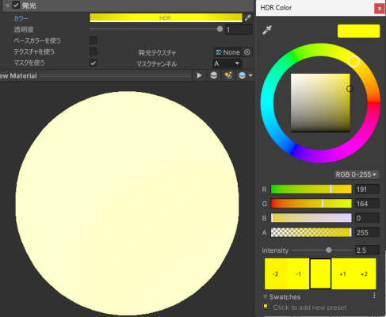
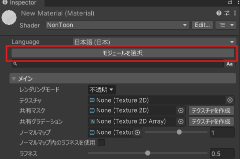
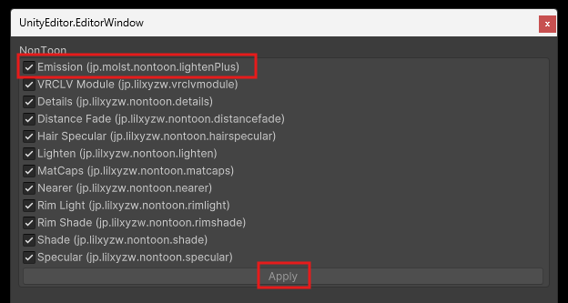

# EmissionModule

[NonToon](https://github.com/lilxyzw/NonToon)のLightenモジュールを改変した発光モジュールです。

従来のシェーダーと同様の使用感にすることを目的としています。

[Download](https://github.com/nx25x/nontoon_EmissionModule/releases)

## 機能
- 発光色/強度の指定
- 発光テクスチャの指定

## 導入
- Unityパッケージをインストール
- NonToonのモジュールを選択 > Emissionを有効化、Apply

